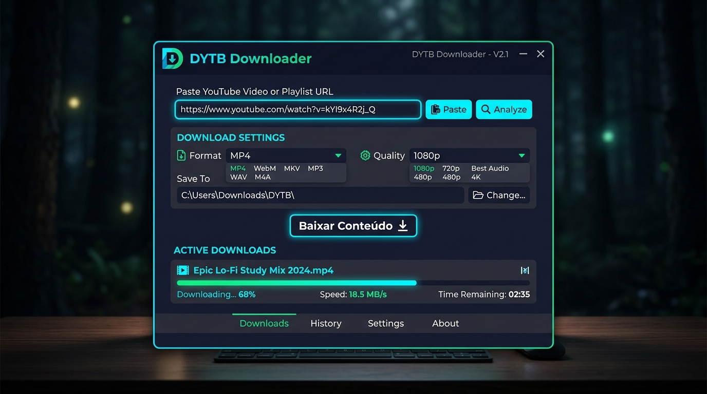
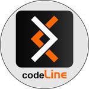

# 🎬 DYTB Downloader

<div align="center">



**Uma ferramenta moderna, poderosa e intuitiva para download e conversão de vídeos e áudios do YouTube, Vimeo, Instagram, TikTok, cursos EAD e streams HLS no Windows.**

[](https://www.python.org/)
[](https://github.com/TomSchimansky/CustomTkinter)
[](https://www.microsoft.com/windows)
[](https://github.com/RickHardBR/DYTB/releases)
[](LICENSE)

</div>

---

## 🌟 Destaques e Funcionalidades

- 🌐 **Suporte Multi-Plataforma**: YouTube, Vimeo (público e embed), TikTok, Instagram (Reels), Twitter/X, Facebook, Twitch, Dailymotion e plataformas de cursos EAD.
- 🎯 **Navegador Sniffer EAD Integrado**: Navegue por aulas protegidas (Hotmart, DIO, Panda Video, Kiwify, Eduzz) conectado à sua própria conta e capture o vídeo com 1 clique ao dar Play!
- 🎥 **Múltiplos Formatos de Vídeo**: Baixe vídeos em **MP4**, **WebM** e **MKV**.
- 🎵 **Extração e Conversão de Áudio**: Salve faixas sonoras diretamente em **MP3 (qualidade máxima)**, **WAV** e **M4A**.
- ⚙️ **Seleção de Resolução**: Suporte a qualidades desde **480p**, **720p HD** até **1080p Full HD** e Melhor Disponível.
- ⚡ **Progresso em Tempo Real**: Monitoramento preciso da porcentagem baixada, velocidade de download, tamanho total e estimativa de tempo restante (ETA).
- 📂 **Gestão de Destino & Nomes Customizados**: Defina a pasta de download e personalize o nome dos arquivos antes de baixar.
- 📜 **Histórico Completo**: Acompanhe todos os seus downloads anteriores com botão para abrir a pasta ou o arquivo com 1 clique.
- 🎨 **Interface Moderna e Elegante**: Design Dark Mode polido construído com CustomTkinter.
- 🚀 **100% Autônomo**: Não requer instalação prévia de Python ou FFmpeg para os usuários dos executáveis.

---

## 📥 Como Usar / Instalação

Você pode utilizar o **DYTB Downloader** de três formas:

### 1️⃣ Versão Portátil (Recomendada para uso rápido)
Baixe o executável [`DYTB.exe`](https://github.com/RickHardBR/DYTB/releases), coloque onde preferir (pasta pessoal ou pendrive) e dê dois cliques para usar imediatamente. Sem instalação e sem burocracia.

### 2️⃣ Instalador Windows (Setup Tradicional)
Baixe o instalador [`DYTB_Setup.exe`](https://github.com/RickHardBR/DYTB/releases).
- Assistente de instalação completo em Português.
- Criação automática de atalho na Área de Trabalho e no Menu Iniciar.
- Desinstalação limpa através do Painel de Controle do Windows.

### 3️⃣ Executando a partir do Código-Fonte

Caso queira rodar o projeto localmente com Python:

```bash
# 1. Clone o repositório
git clone https://github.com/RickHardBR/DYTB.git
cd DYTB

# 2. Crie e ative um ambiente virtual (opcional)
python -m venv venv
venv\Scripts\activate

# 3. Instale as dependências
pip install -r requirements.txt

# 4. Execute o aplicativo
python app.py
```

---

## 🏗️ Como Compilar os Executáveis

O projeto conta com um script de compilação automatizada:

```cmd
build.bat
```

Este script realiza automaticamente:
1. Instalação das dependências listadas em `requirements.txt`.
2. Empacotamento do executável portátil autônomo via **PyInstaller** (`DYTB.spec`).
3. Compilação do instalador oficial **`DYTB_Setup.exe`** via **Inno Setup**.

---

## 📁 Estrutura do Repositório

```text
DYTB/
├── core/                    # Módulos de lógica de download, formatos e configurações
│   ├── downloader.py        # Integração com yt-dlp e controle de processos
│   ├── formats.py           # Validação e configurações de formatos/resoluções
│   ├── history.py           # Gerenciamento do histórico em JSON
│   ├── installer.py         # Resolução e priorização de binários e PATH
│   └── settings.py          # Armazenamento das preferências do usuário
├── ui/                      # Camada de interface visual (CustomTkinter)
│   ├── about_dialog.py      # Janela Sobre e créditos
│   ├── dialogs.py           # Diálogos de progresso, confirmação e erros
│   ├── history_window.py    # Visualizador do histórico de downloads
│   ├── main_window.py       # Janela principal do DYTB
│   └── settings_window.py   # Janela de configurações
├── docs/                    # Documentação e imagens
├── app.py                   # Ponto de entrada da aplicação
├── build.bat                # Script de compilação 1-clique
├── codeline.png             # Logo oficial codeLine
├── DW.ico                   # Ícone da aplicação
├── DYTB.spec                # Especificação de build do PyInstaller
├── historico.md             # Registro histórico detalhado do desenvolvimento
├── installer.iss            # Script de compilação do Inno Setup
├── requirements.txt         # Dependências do projeto
└── test_app.py              # Bateria de testes unitários automatizados
```

---

## 🧪 Testes Automatizados

Para executar os testes unitários do sistema:

```bash
python -m unittest test_app.py
```

---

## 👨‍💻 Desenvolvedor e Créditos

<div align="center">
  
  <br>
  <strong>Desenvolvido por <a href="https://www.instagram.com/rick.hard.dev/">RickHardDev</a></strong>
  <br>
  <em>Desenvolvido com carinho para a comunidade.</em>
</div>

---

## ⚖️ Licença

Este projeto está sob a licença [MIT](LICENSE). Consulte o arquivo de licença para mais detalhes.
